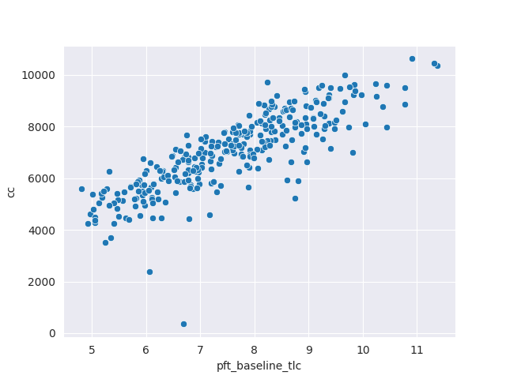
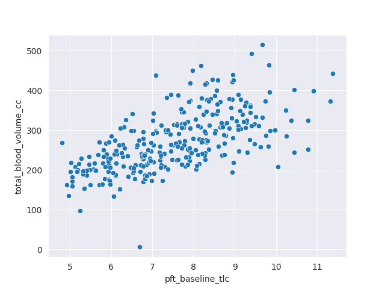
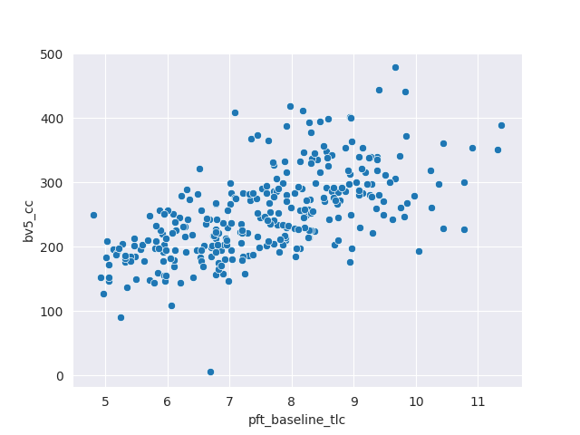

#### cc


```
x_field_name: pft_baseline_tlc
y_field_name: cc

const               185.636737
pft_baseline_tlc    902.517914
dtype: float64
                            OLS Regression Results                            
==============================================================================
Dep. Variable:                     cc   R-squared:                       0.702
Model:                            OLS   Adj. R-squared:                  0.701
Method:                 Least Squares   F-statistic:                     693.6
Date:                Wed, 22 Nov 2023   Prob (F-statistic):           1.90e-79
Time:                        21:49:37   Log-Likelihood:                -2413.7
No. Observations:                 297   AIC:                             4831.
Df Residuals:                     295   BIC:                             4839.
Df Model:                           1                                         
Covariance Type:            nonrobust                                         
====================================================================================
                       coef    std err          t      P>|t|      [0.025      0.975]
------------------------------------------------------------------------------------
const              185.6367    263.361      0.705      0.481    -332.668     703.941
pft_baseline_tlc   902.5179     34.270     26.336      0.000     835.074     969.962
==============================================================================
Omnibus:                      144.790   Durbin-Watson:                   1.458
Prob(Omnibus):                  0.000   Jarque-Bera (JB):             1170.886
Skew:                          -1.812   Prob(JB):                    5.56e-255
Kurtosis:                      12.027   Cond. No.                         43.1
==============================================================================

Notes:
[1] Standard Errors assume that the covariance matrix of the errors is correctly specified.
```
<hr>


#### total_blood_volume_cc


```
x_field_name: pft_baseline_tlc
y_field_name: total_blood_volume_cc

const               20.706931
pft_baseline_tlc    33.391644
dtype: float64
                              OLS Regression Results                             
=================================================================================
Dep. Variable:     total_blood_volume_cc   R-squared:                       0.395
Model:                               OLS   Adj. R-squared:                  0.393
Method:                    Least Squares   F-statistic:                     192.7
Date:                   Wed, 22 Nov 2023   Prob (F-statistic):           4.58e-34
Time:                           21:49:37   Log-Likelihood:                -1624.7
No. Observations:                    297   AIC:                             3253.
Df Residuals:                        295   BIC:                             3261.
Df Model:                              1                                         
Covariance Type:               nonrobust                                         
====================================================================================
                       coef    std err          t      P>|t|      [0.025      0.975]
------------------------------------------------------------------------------------
const               20.7069     18.485      1.120      0.264     -15.673      57.087
pft_baseline_tlc    33.3916      2.405     13.882      0.000      28.658      38.126
==============================================================================
Omnibus:                       13.567   Durbin-Watson:                   1.255
Prob(Omnibus):                  0.001   Jarque-Bera (JB):               21.297
Skew:                           0.300   Prob(JB):                     2.37e-05
Kurtosis:                       4.167   Cond. No.                         43.1
==============================================================================

Notes:
[1] Standard Errors assume that the covariance matrix of the errors is correctly specified.
```
<hr>


#### bv5_cc


```
x_field_name: pft_baseline_tlc
y_field_name: bv5_cc

const               23.858351
pft_baseline_tlc    30.009580
dtype: float64
                            OLS Regression Results                            
==============================================================================
Dep. Variable:                 bv5_cc   R-squared:                       0.383
Model:                            OLS   Adj. R-squared:                  0.381
Method:                 Least Squares   F-statistic:                     183.2
Date:                Wed, 22 Nov 2023   Prob (F-statistic):           8.42e-33
Time:                        21:49:37   Log-Likelihood:                -1600.5
No. Observations:                 297   AIC:                             3205.
Df Residuals:                     295   BIC:                             3212.
Df Model:                           1                                         
Covariance Type:            nonrobust                                         
====================================================================================
                       coef    std err          t      P>|t|      [0.025      0.975]
------------------------------------------------------------------------------------
const               23.8584     17.037      1.400      0.162      -9.672      57.389
pft_baseline_tlc    30.0096      2.217     13.536      0.000      25.646      34.373
==============================================================================
Omnibus:                       15.491   Durbin-Watson:                   1.237
Prob(Omnibus):                  0.000   Jarque-Bera (JB):               25.535
Skew:                           0.327   Prob(JB):                     2.85e-06
Kurtosis:                       4.279   Cond. No.                         43.1
==============================================================================

Notes:
[1] Standard Errors assume that the covariance matrix of the errors is correctly specified.
```
<hr>


