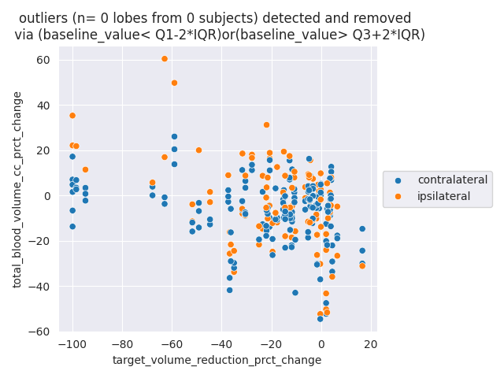

#### cc


```
x_field_name: pft_baseline_tlc
y_field_name: cc

const               185.636737
pft_baseline_tlc    902.517914
dtype: float64
                            OLS Regression Results                            
==============================================================================
Dep. Variable:                     cc   R-squared:                       0.702
Model:                            OLS   Adj. R-squared:                  0.701
Method:                 Least Squares   F-statistic:                     693.6
Date:                Wed, 22 Nov 2023   Prob (F-statistic):           1.90e-79
Time:                        21:49:37   Log-Likelihood:                -2413.7
No. Observations:                 297   AIC:                             4831.
Df Residuals:                     295   BIC:                             4839.
Df Model:                           1                                         
Covariance Type:            nonrobust                                         
====================================================================================
                       coef    std err          t      P>|t|      [0.025      0.975]
------------------------------------------------------------------------------------
const              185.6367    263.361      0.705      0.481    -332.668     703.941
pft_baseline_tlc   902.5179     34.270     26.336      0.000     835.074     969.962
==============================================================================
Omnibus:                      144.790   Durbin-Watson:                   1.458
Prob(Omnibus):                  0.000   Jarque-Bera (JB):             1170.886
Skew:                          -1.812   Prob(JB):                    5.56e-255
Kurtosis:                      12.027   Cond. No.                         43.1
==============================================================================

Notes:
[1] Standard Errors assume that the covariance matrix of the errors is correctly specified.
```
<hr>


#### total_blood_volume_cc


```
x_field_name: pft_baseline_tlc
y_field_name: total_blood_volume_cc

const               20.706931
pft_baseline_tlc    33.391644
dtype: float64
                              OLS Regression Results                             
=================================================================================
Dep. Variable:     total_blood_volume_cc   R-squared:                       0.395
Model:                               OLS   Adj. R-squared:                  0.393
Method:                    Least Squares   F-statistic:                     192.7
Date:                   Wed, 22 Nov 2023   Prob (F-statistic):           4.58e-34
Time:                           21:49:37   Log-Likelihood:                -1624.7
No. Observations:                    297   AIC:                             3253.
Df Residuals:                        295   BIC:                             3261.
Df Model:                              1                                         
Covariance Type:               nonrobust                                         
====================================================================================
                       coef    std err          t      P>|t|      [0.025      0.975]
------------------------------------------------------------------------------------
const               20.7069     18.485      1.120      0.264     -15.673      57.087
pft_baseline_tlc    33.3916      2.405     13.882      0.000      28.658      38.126
==============================================================================
Omnibus:                       13.567   Durbin-Watson:                   1.255
Prob(Omnibus):                  0.001   Jarque-Bera (JB):               21.297
Skew:                           0.300   Prob(JB):                     2.37e-05
Kurtosis:                       4.167   Cond. No.                         43.1
==============================================================================

Notes:
[1] Standard Errors assume that the covariance matrix of the errors is correctly specified.
```
<hr>


#### bv5_cc


```
x_field_name: pft_baseline_tlc
y_field_name: bv5_cc

const               23.858351
pft_baseline_tlc    30.009580
dtype: float64
                            OLS Regression Results                            
==============================================================================
Dep. Variable:                 bv5_cc   R-squared:                       0.383
Model:                            OLS   Adj. R-squared:                  0.381
Method:                 Least Squares   F-statistic:                     183.2
Date:                Wed, 22 Nov 2023   Prob (F-statistic):           8.42e-33
Time:                        21:49:37   Log-Likelihood:                -1600.5
No. Observations:                 297   AIC:                             3205.
Df Residuals:                     295   BIC:                             3212.
Df Model:                           1                                         
Covariance Type:            nonrobust                                         
====================================================================================
                       coef    std err          t      P>|t|      [0.025      0.975]
------------------------------------------------------------------------------------
const               23.8584     17.037      1.400      0.162      -9.672      57.389
pft_baseline_tlc    30.0096      2.217     13.536      0.000      25.646      34.373
==============================================================================
Omnibus:                       15.491   Durbin-Watson:                   1.237
Prob(Omnibus):                  0.000   Jarque-Bera (JB):               25.535
Skew:                           0.327   Prob(JB):                     2.85e-06
Kurtosis:                       4.279   Cond. No.                         43.1
==============================================================================

Notes:
[1] Standard Errors assume that the covariance matrix of the errors is correctly specified.
```
<hr>


#### cc_prct_change


+ kind: ipsilateral-nontarget
+ x_field_name: target_volume_reduction_prct_change
+ y_field_name: cc_prct_change

```
const                                 -0.612801
target_volume_reduction_prct_change   -0.420017
dtype: float64
                            OLS Regression Results                            
==============================================================================
Dep. Variable:         cc_prct_change   R-squared:                       0.347
Model:                            OLS   Adj. R-squared:                  0.341
Method:                 Least Squares   F-statistic:                     53.67
Date:                Wed, 22 Nov 2023   Prob (F-statistic):           5.94e-11
Time:                        21:49:25   Log-Likelihood:                -414.91
No. Observations:                 103   AIC:                             833.8
Df Residuals:                     101   BIC:                             839.1
Df Model:                           1                                         
Covariance Type:            nonrobust                                         
=======================================================================================================
                                          coef    std err          t      P>|t|      [0.025      0.975]
-------------------------------------------------------------------------------------------------------
const                                  -0.6128      1.715     -0.357      0.722      -4.015       2.789
target_volume_reduction_prct_change    -0.4200      0.057     -7.326      0.000      -0.534      -0.306
==============================================================================
Omnibus:                       12.975   Durbin-Watson:                   2.130
Prob(Omnibus):                  0.002   Jarque-Bera (JB):               21.464
Skew:                          -0.529   Prob(JB):                     2.18e-05
Kurtosis:                       4.971   Cond. No.                         37.9
==============================================================================

Notes:
[1] Standard Errors assume that the covariance matrix of the errors is correctly specified.

```


+ kind: contralateral-nontarget
+ x_field_name: target_volume_reduction_prct_change
+ y_field_name: cc_prct_change

```
const                                 -0.261306
target_volume_reduction_prct_change   -0.036229
dtype: float64
                            OLS Regression Results                            
==============================================================================
Dep. Variable:         cc_prct_change   R-squared:                       0.013
Model:                            OLS   Adj. R-squared:                  0.007
Method:                 Least Squares   F-statistic:                     2.194
Date:                Wed, 22 Nov 2023   Prob (F-statistic):              0.140
Time:                        21:49:25   Log-Likelihood:                -620.96
No. Observations:                 173   AIC:                             1246.
Df Residuals:                     171   BIC:                             1252.
Df Model:                           1                                         
Covariance Type:            nonrobust                                         
=======================================================================================================
                                          coef    std err          t      P>|t|      [0.025      0.975]
-------------------------------------------------------------------------------------------------------
const                                  -0.2613      0.846     -0.309      0.758      -1.931       1.408
target_volume_reduction_prct_change    -0.0362      0.024     -1.481      0.140      -0.085       0.012
==============================================================================
Omnibus:                       40.577   Durbin-Watson:                   1.523
Prob(Omnibus):                  0.000   Jarque-Bera (JB):              265.399
Skew:                          -0.609   Prob(JB):                     2.34e-58
Kurtosis:                       8.944   Cond. No.                         43.7
==============================================================================

Notes:
[1] Standard Errors assume that the covariance matrix of the errors is correctly specified.

```


<hr>


#### total_blood_volume_cc_prct_change



+ kind: ipsilateral-nontarget
+ x_field_name: target_volume_reduction_prct_change
+ y_field_name: total_blood_volume_cc_prct_change

```
const                                 -9.747686
target_volume_reduction_prct_change   -0.362276
dtype: float64
                                    OLS Regression Results                                   
=============================================================================================
Dep. Variable:     total_blood_volume_cc_prct_change   R-squared:                       0.207
Model:                                           OLS   Adj. R-squared:                  0.199
Method:                                Least Squares   F-statistic:                     26.42
Date:                               Wed, 22 Nov 2023   Prob (F-statistic):           1.35e-06
Time:                                       21:49:25   Log-Likelihood:                -436.18
No. Observations:                                103   AIC:                             876.4
Df Residuals:                                    101   BIC:                             881.6
Df Model:                                          1                                         
Covariance Type:                           nonrobust                                         
=======================================================================================================
                                          coef    std err          t      P>|t|      [0.025      0.975]
-------------------------------------------------------------------------------------------------------
const                                  -9.7477      2.108     -4.624      0.000     -13.930      -5.565
target_volume_reduction_prct_change    -0.3623      0.070     -5.140      0.000      -0.502      -0.222
==============================================================================
Omnibus:                        1.758   Durbin-Watson:                   1.646
Prob(Omnibus):                  0.415   Jarque-Bera (JB):                1.243
Skew:                          -0.238   Prob(JB):                        0.537
Kurtosis:                       3.253   Cond. No.                         37.9
==============================================================================

Notes:
[1] Standard Errors assume that the covariance matrix of the errors is correctly specified.

```


+ kind: contralateral-nontarget
+ x_field_name: target_volume_reduction_prct_change
+ y_field_name: total_blood_volume_cc_prct_change

```
const                                 -9.511377
target_volume_reduction_prct_change   -0.120172
dtype: float64
                                    OLS Regression Results                                   
=============================================================================================
Dep. Variable:     total_blood_volume_cc_prct_change   R-squared:                       0.061
Model:                                           OLS   Adj. R-squared:                  0.055
Method:                                Least Squares   F-statistic:                     11.04
Date:                               Wed, 22 Nov 2023   Prob (F-statistic):            0.00109
Time:                                       21:49:25   Log-Likelihood:                -688.61
No. Observations:                                173   AIC:                             1381.
Df Residuals:                                    171   BIC:                             1388.
Df Model:                                          1                                         
Covariance Type:                           nonrobust                                         
=======================================================================================================
                                          coef    std err          t      P>|t|      [0.025      0.975]
-------------------------------------------------------------------------------------------------------
const                                  -9.5114      1.251     -7.605      0.000     -11.980      -7.043
target_volume_reduction_prct_change    -0.1202      0.036     -3.323      0.001      -0.192      -0.049
==============================================================================
Omnibus:                       24.013   Durbin-Watson:                   1.066
Prob(Omnibus):                  0.000   Jarque-Bera (JB):               32.111
Skew:                          -0.832   Prob(JB):                     1.06e-07
Kurtosis:                       4.299   Cond. No.                         43.7
==============================================================================

Notes:
[1] Standard Errors assume that the covariance matrix of the errors is correctly specified.

```


<hr>


#### bv5_cc_prct_change


+ kind: ipsilateral-nontarget
+ x_field_name: target_volume_reduction_prct_change
+ y_field_name: bv5_cc_prct_change

```
const                                 -9.716076
target_volume_reduction_prct_change   -0.415347
dtype: float64
                            OLS Regression Results                            
==============================================================================
Dep. Variable:     bv5_cc_prct_change   R-squared:                       0.263
Model:                            OLS   Adj. R-squared:                  0.255
Method:                 Least Squares   F-statistic:                     35.97
Date:                Wed, 22 Nov 2023   Prob (F-statistic):           3.14e-08
Time:                        21:49:26   Log-Likelihood:                -434.37
No. Observations:                 103   AIC:                             872.7
Df Residuals:                     101   BIC:                             878.0
Df Model:                           1                                         
Covariance Type:            nonrobust                                         
=======================================================================================================
                                          coef    std err          t      P>|t|      [0.025      0.975]
-------------------------------------------------------------------------------------------------------
const                                  -9.7161      2.071     -4.690      0.000     -13.825      -5.607
target_volume_reduction_prct_change    -0.4153      0.069     -5.998      0.000      -0.553      -0.278
==============================================================================
Omnibus:                        4.777   Durbin-Watson:                   1.514
Prob(Omnibus):                  0.092   Jarque-Bera (JB):                4.118
Skew:                          -0.447   Prob(JB):                        0.128
Kurtosis:                       3.401   Cond. No.                         37.9
==============================================================================

Notes:
[1] Standard Errors assume that the covariance matrix of the errors is correctly specified.

```


+ kind: contralateral-nontarget
+ x_field_name: target_volume_reduction_prct_change
+ y_field_name: bv5_cc_prct_change

```
const                                 -9.084252
target_volume_reduction_prct_change   -0.130371
dtype: float64
                            OLS Regression Results                            
==============================================================================
Dep. Variable:     bv5_cc_prct_change   R-squared:                       0.070
Model:                            OLS   Adj. R-squared:                  0.065
Method:                 Least Squares   F-statistic:                     12.95
Date:                Wed, 22 Nov 2023   Prob (F-statistic):           0.000419
Time:                        21:49:26   Log-Likelihood:                -688.93
No. Observations:                 173   AIC:                             1382.
Df Residuals:                     171   BIC:                             1388.
Df Model:                           1                                         
Covariance Type:            nonrobust                                         
=======================================================================================================
                                          coef    std err          t      P>|t|      [0.025      0.975]
-------------------------------------------------------------------------------------------------------
const                                  -9.0843      1.253     -7.250      0.000     -11.558      -6.611
target_volume_reduction_prct_change    -0.1304      0.036     -3.599      0.000      -0.202      -0.059
==============================================================================
Omnibus:                       31.046   Durbin-Watson:                   0.971
Prob(Omnibus):                  0.000   Jarque-Bera (JB):               47.488
Skew:                          -0.963   Prob(JB):                     4.88e-11
Kurtosis:                       4.697   Cond. No.                         43.7
==============================================================================

Notes:
[1] Standard Errors assume that the covariance matrix of the errors is correctly specified.

```


<hr>
